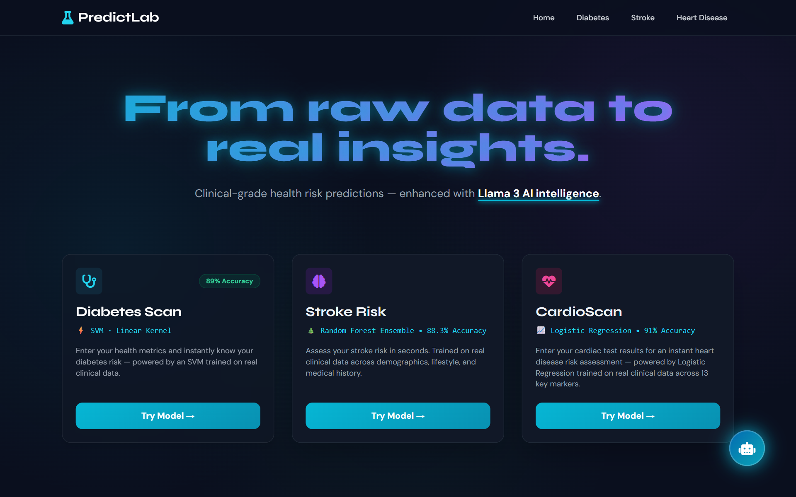
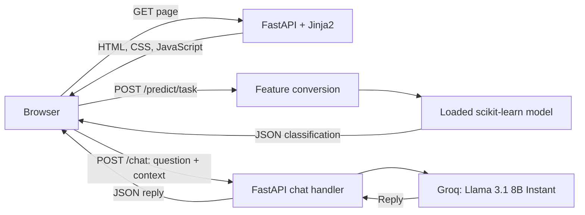
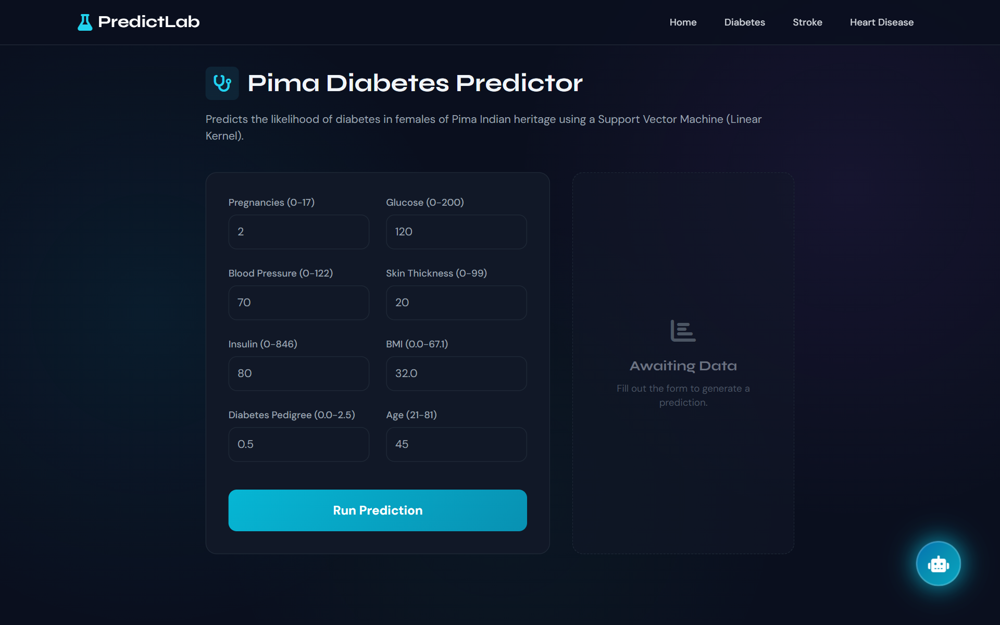
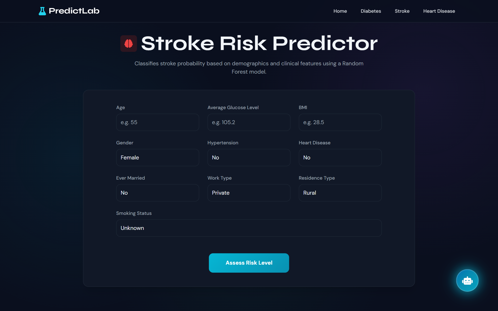
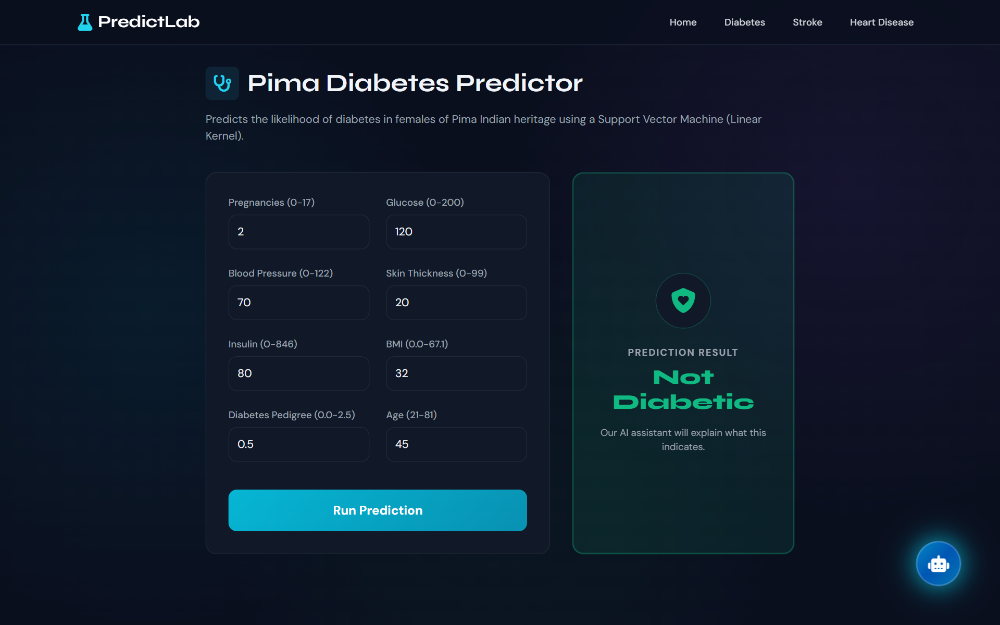
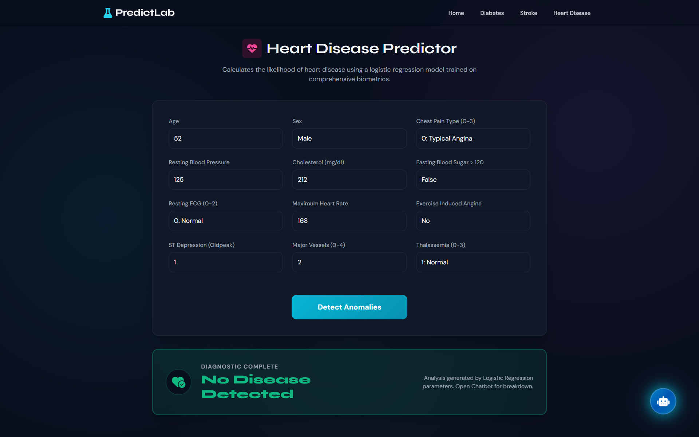
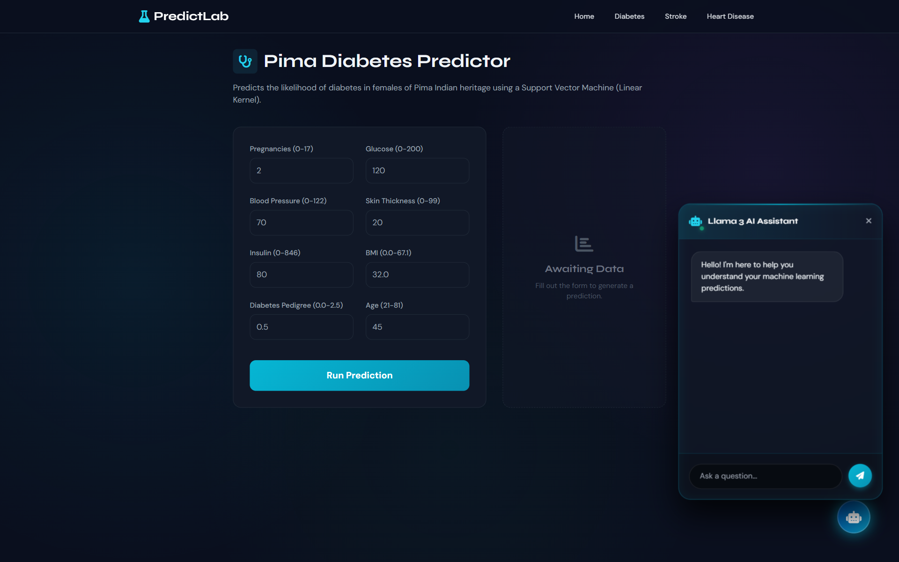

# 🧬 PredictLab

**Health risk prediction with scikit-learn, FastAPI, and a contextual Llama assistant.**

   

[Live demo](https://huggingface.co/spaces/VINAYAKKV/Predict-Ai) · [Project showcase](#-project-showcase) · [Setup](#-installation-and-setup) · [API examples](#-usage-examples)

## 🚀 Overview

PredictLab is a full-stack ML inference application for exploring diabetes, stroke risk, and heart disease classification. Users enter health metrics through dedicated forms, submit them to a FastAPI backend, and view the returned classification. A Groq-powered assistant receives the current page, submitted inputs, and prediction label to help explain a result.

The application serves Jinja2 pages and its JSON endpoints from the same process. It includes serialized models and a Dockerfile for deployment on Hugging Face Spaces. This repository demonstrates model integration and application development; it does not include a model-training or evaluation workflow.



*The dashboard provides entry points to the three prediction interfaces.*

> **Demo status — 1 October 2026:** Diabetes and heart predictions returned results during screenshot capture. The deployed stroke model was unavailable, and assistant requests returned a connection error. The screenshots show the actual interfaces and successful model outputs; the assistant image shows its original welcome state.

## ✨ Key features

- **Dedicated prediction forms:** Eight diabetes metrics, ten stroke inputs, and twelve cardiac inputs, with browser-side required fields and numeric constraints.
- **In-page results:** Vanilla JavaScript submits forms with `fetch`, displays loading states, and updates result panels without reloading the page. Navigation between predictor pages uses regular links.
- **Contextual assistant integration:** Successful predictions trigger an explanation request. Users can also ask questions through the shared chat widget when Groq is configured and reachable.
- **Independent model loading:** Each model is loaded at startup. A missing or incompatible artifact disables its prediction endpoint while the other pages remain available.
- **Responsive interface:** Tailwind utilities, custom CSS, dark panels, animated accents, and a shared navigation and chat layout.
- **One service to run:** FastAPI serves HTML, static assets, prediction endpoints, and the assistant endpoint; no frontend build step is required.

## 🧠 AI/ML capabilities

| Task | Artifact and inference path | Returned labels |
| --- | --- | --- |
| Pima diabetes | Linear-kernel `SVC`; a `StandardScaler` transforms the eight input features before prediction | `Diabetic` / `Not Diabetic` |
| Stroke risk | Serialized scikit-learn pipeline receiving a ten-column DataFrame; the interface identifies the classifier as Random Forest | `High Stroke Risk` / `Low Stroke Risk` |
| Heart disease | `LogisticRegression` receiving twelve numeric features in the order defined in `main.py` | `Disease Detected` / `No Disease Detected` |

[models/loader.py](models/loader.py) attempts `joblib.load` first, then `pickle.load`, and logs failures without aborting startup. The runtime artifacts are `diabetes_model.sav`, `diabetes_scaler.sav`, `stroke_model.pkl`, and `heart_model.pkl` inside `models/`.

**Current artifact status:** The included diabetes and heart models load and return predictions with Python 3.13 and scikit-learn 1.8.0. The included stroke artifact fails to deserialize in that environment, so `/predict/stroke` returns HTTP `500` until a compatible artifact is supplied. Its classifier and performance could not be verified.

The assistant uses Groq's **`llama-3.1-8b-instant`** model with the current page, input values, and prediction label embedded in its system prompt. It sends each question independently; the visible chat transcript is not sent as conversation history and resets on page navigation. The prompt asks for concise explanations and professional consultation rather than definitive diagnoses.

The endpoints return classifications, not calibrated probabilities. Diabetes and stroke responses include `"confidence": null`; the heart response has no confidence field. Accuracy percentages visible in the original UI are not backed by an evaluation script, dataset, or report in this repository.

## 🏗️ Architecture and workflow



1. At startup, the backend loads the model artifacts and initializes the optional Groq client.
2. A user selects a predictor and submits its form. The backend converts the JSON values into the model's expected DataFrame or NumPy array.
3. The model's `predict` output is mapped to a label and displayed in the existing result panel.
4. The browser updates its chat context and requests an explanation. This separate request depends on the Groq API key and service availability.

The app has no database or prediction-history storage. Model inference is local to the server; assistant questions and their supplied prediction context are sent to Groq.

## 🛠️ Tech stack

| Layer | Technologies | Role |
| --- | --- | --- |
| Runtime and server | Python 3.13, FastAPI, Uvicorn | Page rendering and JSON endpoints |
| Model inference | scikit-learn 1.8.0, pandas, NumPy | Feature preparation, scaling, and classification |
| Serialization | Joblib, Python pickle | Loading the included model artifacts |
| Assistant | Groq Python SDK, Llama 3.1 8B Instant | Explanations based on request context |
| Frontend | Jinja2, HTML, vanilla JavaScript, Tailwind CSS, custom CSS | Forms, loading states, result panels, and chat |
| Visual assets | Font Awesome, Google Fonts | Icons and typography |
| Configuration and deployment | python-dotenv, Docker, Hugging Face Spaces | Environment loading and container hosting |

Only scikit-learn is version-pinned in [requirements.txt](requirements.txt). The Docker image uses Python 3.13. Tailwind, Font Awesome, and fonts are loaded from external providers, so the original UI requires browser network access.

## 📸 Project showcase

These six screenshots were captured directly from the deployed app at **1920 × 1200**. Prediction examples use synthetic inputs and real model responses; the original UI and branding are preserved.

| Diabetes inputs | Stroke inputs |
| :---: | :---: |
|  |  |
| Eight health metrics feed the diabetes model. | Demographic, clinical, and lifestyle fields define the stroke request. |

| Diabetes result | Heart disease result |
| :---: | :---: |
|  |  |
| Submitted values remain visible beside the returned classification. | The complete cardiac form and its returned result are shown together. |

### Assistant interface



*The shared assistant panel is shown in its original welcome state. This image demonstrates the interface, not a successful live LLM response.*

## ⚙️ Installation and setup

**Requirements:** Git, Python **3.13**, and pip. Docker is optional. A Groq API key is required for assistant responses, but the prediction endpoints can run without it.

Clone the repository:

```bash
git clone https://github.com/vinayak533/PredictLab-.git
cd PredictLab-
```

Create and activate an isolated environment:

<details>
<summary>Windows PowerShell</summary>

```powershell
python -m venv .venv
.\.venv\Scripts\Activate.ps1
python -m pip install -r requirements.txt
Copy-Item .env.example .env
```

If your PowerShell policy prevents activation, use `.\.venv\Scripts\python.exe` instead of `python` in the installation and run commands.

</details>

<details>
<summary>macOS / Linux</summary>

```bash
python3.13 -m venv .venv
source .venv/bin/activate
python -m pip install -r requirements.txt
cp .env.example .env
```

</details>

Edit `.env` to configure the optional assistant. The serialized models are already included in `models/`; they must stay alongside `loader.py`. Retain the scikit-learn pin because serialized estimators can be incompatible across library versions.

## ▶️ Run the project

Run from the repository root, where `main.py`, `templates/`, and `static/` are located:

```bash
python -m uvicorn main:app --reload
```

Open **[http://127.0.0.1:8000](http://127.0.0.1:8000)**. The same server hosts the frontend and API; FastAPI's interactive API documentation is available at **[/docs](http://127.0.0.1:8000/docs)**. Stop the development server with `Ctrl+C`.

### Docker

```bash
docker build -t predictlab .
docker run --rm -p 7860:7860 --env-file .env predictlab
```

Open **[http://localhost:7860](http://localhost:7860)**. To run predictions without an assistant key, omit `--env-file .env`. The [Dockerfile](Dockerfile) starts Uvicorn on `0.0.0.0:7860`; it does not use development reload mode.

<details>
<summary>Deploying to Hugging Face Spaces</summary>

For a Docker Space, place the following metadata at the beginning of the **Space repository's** README. Keep the Dockerfile at its repository root and configure `GROQ_API_KEY` as a Space secret when deploying the assistant.

```yaml
---
title: PredictLab AI
emoji: 🧬
colorFrom: blue
colorTo: indigo
sdk: docker
pinned: false
---
```

</details>

## 🔧 Configuration

| Variable | Required | Purpose |
| --- | --- | --- |
| `GROQ_API_KEY` | For assistant responses only | Authenticates server-side requests to Groq |

```dotenv
GROQ_API_KEY=your_groq_api_key_here
```

Use [.env.example](.env.example) as the template. `.env` is ignored by Git and excluded from the Docker build context; Docker receives it at runtime through `--env-file`. Restart the server after changing the key. The Llama model ID is currently defined in [main.py](main.py), not an environment variable.

## 💡 Usage examples

In the browser, select **Diabetes**, enter synthetic values such as pregnancies `2`, glucose `120`, blood pressure `70`, skin thickness `20`, insulin `80`, BMI `32`, pedigree `0.5`, and age `45`, then select **Run Prediction**. The captured deployment returned `Not Diabetic` for this example. Open the assistant panel to ask a question when the Groq service is available.

### Python API example

The following uses only Python's standard library and a running local server:

```python
import json
from urllib.request import Request, urlopen

payload = {
    "pregnancies": 2,
    "glucose": 120,
    "blood_pressure": 70,
    "skin_thickness": 20,
    "insulin": 80,
    "bmi": 32,
    "dpf": 0.5,
    "age": 45,
}
request = Request(
    "http://127.0.0.1:8000/predict/diabetes",
    data=json.dumps(payload).encode("utf-8"),
    headers={"Content-Type": "application/json"},
    method="POST",
)
with urlopen(request) as response:
    print(json.load(response))
```

Example response from the captured deployment:

```json
{"prediction": 0, "label": "Not Diabetic", "confidence": null}
```

### Endpoint reference

| Method | Route | Purpose |
| --- | --- | --- |
| `GET` | `/`, `/diabetes`, `/stroke`, `/heart` | Dashboard and predictor pages |
| `POST` | `/predict/diabetes` | Diabetes classification from eight metrics |
| `POST` | `/predict/stroke` | Stroke classification from ten inputs |
| `POST` | `/predict/heart` | Heart disease classification from twelve inputs |
| `POST` | `/chat` | Assistant reply to a question and supplied context |
| `GET` | `/docs` | Interactive API documentation |

<details>
<summary>Request fields and chat payload</summary>

| Endpoint | JSON fields |
| --- | --- |
| Diabetes | `pregnancies`, `glucose`, `blood_pressure`, `skin_thickness`, `insulin`, `bmi`, `dpf`, `age` |
| Stroke | `gender`, `age`, `hypertension`, `heart_disease`, `ever_married`, `work_type`, `residence_type`, `avg_glucose_level`, `bmi`, `smoking_status` |
| Heart | `age`, `sex`, `cp`, `trestbps`, `chol`, `fbs`, `restecg`, `thalach`, `exang`, `oldpeak`, `ca`, `thal` |

The forms define the categorical options and numeric ranges. The stroke handler converts `residence_type` into the model column `Residence_type`; the heart handler preserves the field order shown above.

```json
{
  "message": "What does this prediction mean?",
  "context": {
    "current_page": "diabetes",
    "inputs": {"glucose": 120, "bmi": 32, "age": 45},
    "prediction": "Not Diabetic"
  }
}
```

A successful chat response is `{"reply": "..."}`. Missing models and an unavailable Groq client return HTTP `500` with an `error` field. Conversion or inference exceptions in prediction handlers return HTTP `400`; malformed chat payloads are validated by Pydantic.

</details>

## 📂 Project structure

```text
PredictLab-/
├── README.md
├── main.py                    # Page, prediction, and chat routes
├── requirements.txt           # Runtime dependencies
├── Dockerfile                 # Python 3.13; Uvicorn on port 7860
├── .dockerignore              # Excludes local secrets and development artifacts
├── .env.example               # Optional Groq key template
├── .gitignore
├── images/                    # Six actual project screenshots
├── models/
│   ├── loader.py              # Independent artifact loading and fallbacks
│   ├── diabetes_model.sav
│   ├── diabetes_scaler.sav
│   ├── stroke_model.pkl
│   └── heart_model.pkl
├── templates/
│   ├── base.html               # Shared layout, navigation, and chat logic
│   ├── index.html              # Model dashboard
│   ├── diabetes.html           # Diabetes form and result logic
│   ├── stroke.html             # Stroke form and result logic
│   └── heart.html              # Heart form and result logic
└── static/
    └── style.css              # Theme, animations, and chat styling
```

<details>
<summary>Adding another predictor</summary>

1. Add a compatible trusted model artifact and register it in `models/loader.py`.
2. Add the page route and JSON prediction handler in `main.py`, preserving the model's expected feature names and order.
3. Add a Jinja2 form, its submission and result logic, and links in the dashboard and shared navigation. Pass successful results through `window.onPredictionComplete` to supply assistant context.

</details>

## 🛡️ Limitations and requirements

- **Educational use:** These classifications and LLM explanations are not medical diagnoses. The repository contains no clinical validation or evidence supporting the UI's “clinical-grade” wording. The diabetes page describes a Pima female population; it does not establish suitability for other populations.
- **Model reproducibility:** Training data, training scripts, evaluation reports, and automated tests are not included. Preserve the artifact filenames and compatible Python/scikit-learn environment, and inspect startup logs for loader failures.
- **Validation:** Browser forms impose input constraints. Prediction APIs accept dictionaries and convert values; they do not enforce the same ranges through typed request schemas.
- **Assistant availability and data flow:** Groq responses require a valid key, network access, and provider availability. The request sends the question and health inputs included in its context to Groq; use synthetic data for public demonstrations.
- **Operational scope:** Authentication, rate limiting, persistent history, and production monitoring are not implemented. The current request handlers use synchronous model and Groq calls; concurrency and latency have not been benchmarked.
- **Trusted artifacts:** Joblib/pickle model files must come from trusted sources; loading them can execute Python code.

## 🗺️ Possible improvements

These are follow-up opportunities, not implemented features or committed delivery dates:

- Publish the training and evaluation workflow with dataset provenance and per-model compatibility checks.
- Add typed prediction schemas and automated endpoint tests, including unavailable-model and unavailable-assistant cases.
- Package frontend dependencies locally and improve request handling, observability, and deployment hardening before broader use.
